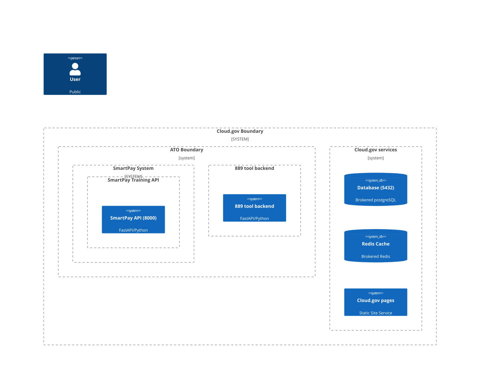

```mermaid
---
title:SmartPay System Architecture
---
C4Context
Person(Public, "User", "Public")
System_Boundary(cloud_gov, "Cloud.gov Boundary", "") {
    Boundary(ato, "ATO Boundary") {
      System_Boundary(sp_api,"SmartPay System") {
        Boundary(backend, "SmartPay Training API", "") {
            System(FastAPI, "SmartPay API (8000)", "FastAPI/Python") }
      }
        Boundary(889_backend, "889 tool backend", "") {
            System(889, "889 tool backend", "FastAPI/Python")
        }
       
    }
    Boundary(cloudgov-services,"Cloud.gov services") {
        SystemDb(db, "Database (5432)", "Brokered postgreSQL")
        SystemDb(redis, "Redis Cache", "Brokered Redis")
        System(pages, "Cloud.gov pages", "Static Site Service")
    }
}    
```